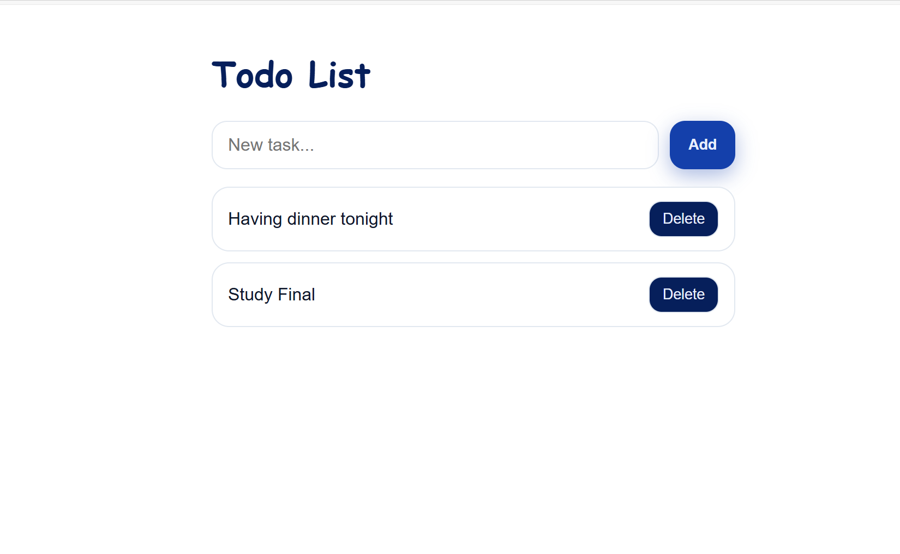

## Todo List (React + Express + MongoDB)
A simple full-stack Todo List application using **React** (frontend) and **Express + MongoDB Atlas** (backend).

## Features
- View all todos
- Add a new todo
- Delete a todo
- Data is persisted in MongoDB

## Technologies Used
- React
- Express
- MongoDB Atlas
- Node.js
- dotenv

## How to Run the Project

## Backend
1. Open a terminal  
2. `cd backend`  
3. `npm install`  
4. Create a `.env` file inside `backend/` with the following content:
   ```env
   MONGODB_URI=your_connection_string_here
   DB_NAME=todo_db
5. Run the server: node server.js

## Frontend
1. Open another terminal
2. `cd frontend`
3. `npm install`
4. `npm start`  

## Usage
Add a new todo
Delete an existing todo

## Screenshots

